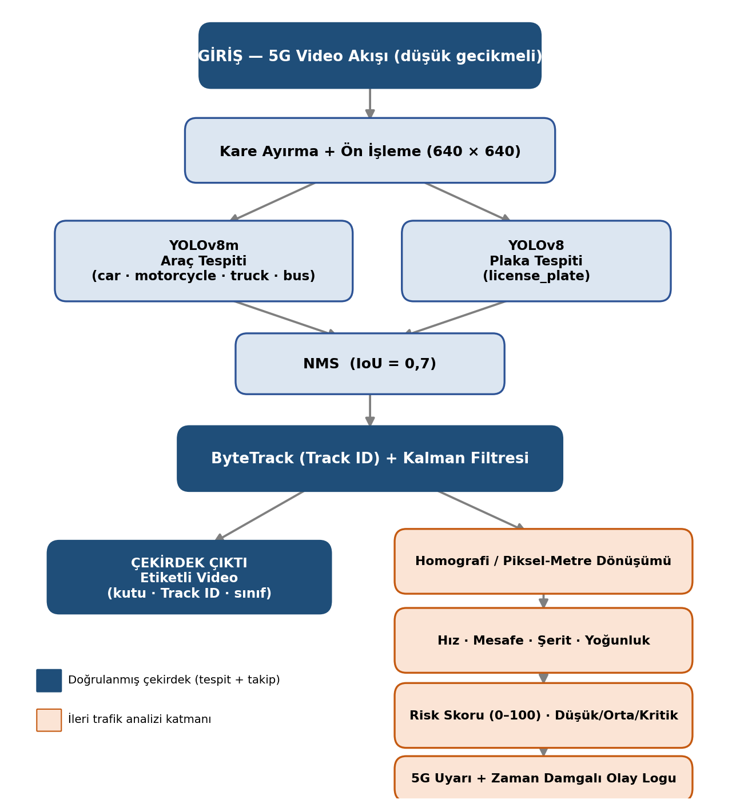
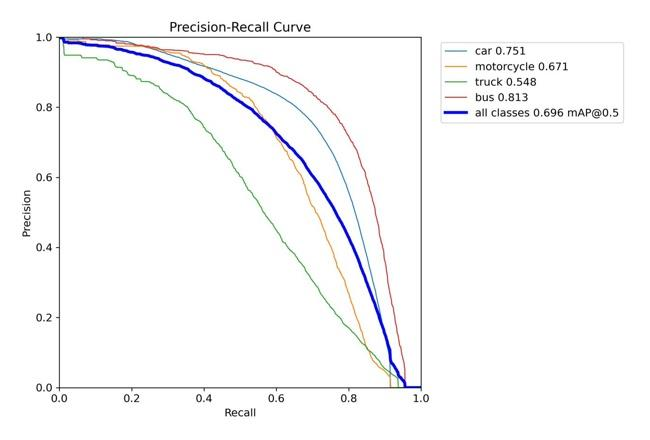
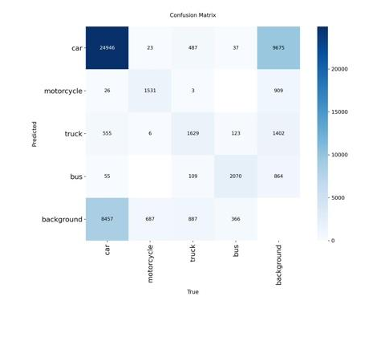
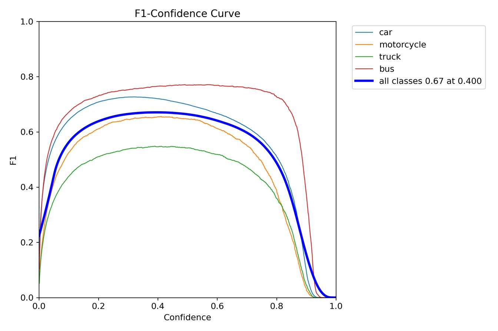
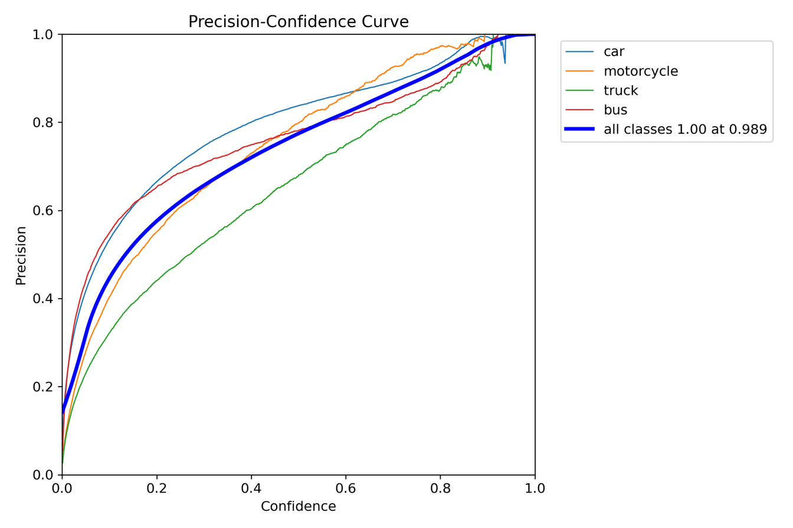
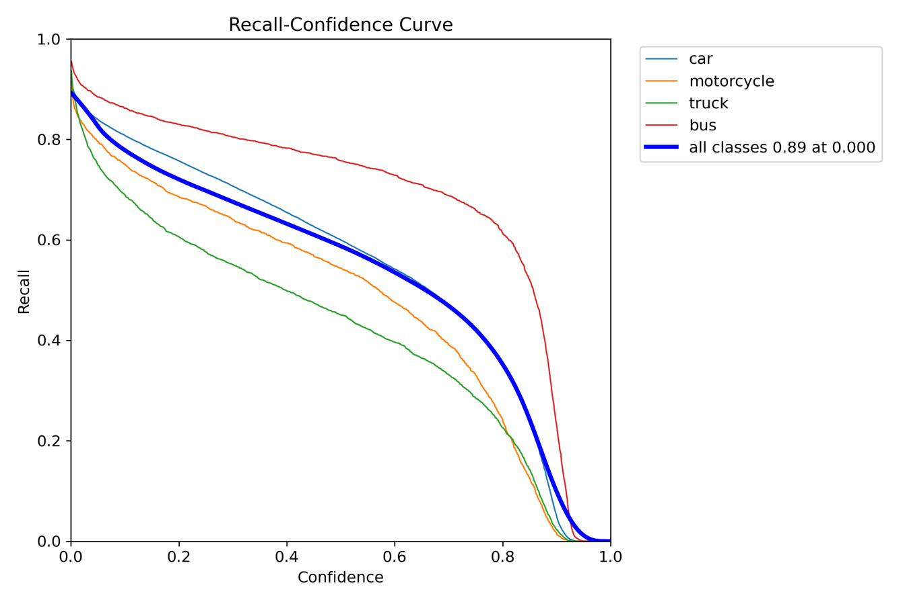
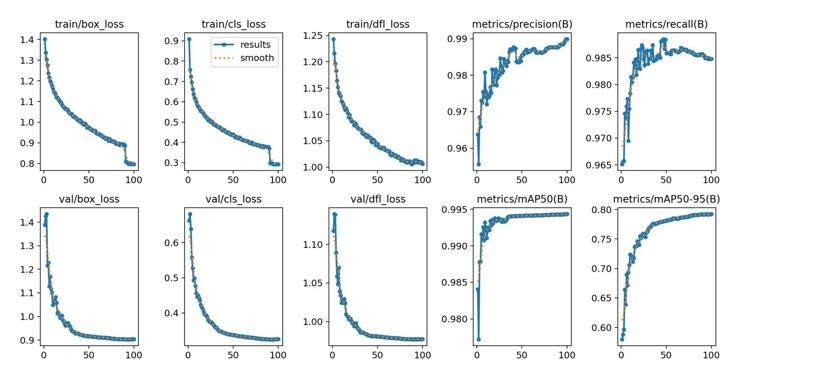
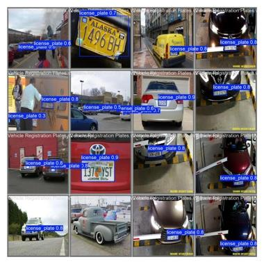

# 5G & Yapay Zekâ ile Akıllı Yol Güvenliği


Video akışından araç, plaka ve riskli trafik durumu tespiti yapan, 5G uyarı katmanına sahip bir yol güvenliği prototipi.

Bu depo, TEKNOFEST 5G & Yapay Zekâ ile Akıllı Yol Güvenliği Yarışması için hazırlanan çözümün kaynak kodunu içerir.

---

## İçindekiler

- [Proje Özeti](#proje-özeti)
- [Çözüm Mimarisi](#çözüm-mimarisi)
- [Veri Seti](#veri-seti)
- [Model Eğitimi](#model-eğitimi)
- [Sonuçlar](#sonuçlar)
- [Kurulum](#kurulum)
- [Kullanım](#kullanım)
- [Çıktı Formatı](#çıktı-formatı)
- [Yapılandırma ve Risk Skoru](#yapılandırma-ve-risk-skoru)
- [Dosya Yapısı](#dosya-yapısı)
- [Sınırlılıklar](#sınırlılıklar)
- [Kaynakça ve Veri Seti Atıfları](#kaynakça-ve-veri-seti-atıfları)

---

## Proje Özeti

Sistem, 5G destekli yol güvenliği senaryolarında video akışından araç, plaka ve riskli trafik durumlarını tespit eder. Şu parçaları tek akışta birleştirir:

- Araç tespiti (YOLOv8m) ve bağımsız plaka tespiti (YOLOv8s)
- Çoklu nesne takibi (ByteTrack + Kalman filtresi)
- Hız ve mesafe tahmini, araçlar arası TTC (çarpışmaya kalan süre)
- Şerit ve yoğunluk analizi
- 0–100 arası çok faktörlü risk skoru
- Eşik aşımında 5G uyarı çıktısı ve zaman damgalı olay kaydı (CSV + JSON)

Bileşenlerin ne kadar doğrulandığı birbirinden farklı, o yüzden ayrı ayrı yazıyorum:

| Katman | Bileşen | Durum |
|---|---|---|
| Çekirdek | Araç tespiti, plaka tespiti, ByteTrack + Kalman takibi | Ayrılmış değerlendirme setlerinde metriklerle doğrulandı |
| İleri analiz | Piksel-metre ölçek dönüşümü (araç boyutlarından otomatik tahmin; raporda homografi / sahne kalibrasyonu olarak geçer), hız, mesafe, şerit, yoğunluk, risk skoru | Video üzerinde fonksiyonel olarak çalışıyor; sayısal doğruluk kamera kalibrasyonuna bağlı |
| Uyarı | 5G olay aktarımı | Eşik aşımı, zaman damgalı log ve uyarı tasarımı; gecikme alanı (`latency_ms`) simüle edilmiş sabit değerdir, gerçek bir 5G bağlantısı kurulmamıştır |

---

## Çözüm Mimarisi

<p align="center">
  
</p>

Koyu mavi bloklar doğrulanmış çekirdek (tespit + takip), turuncu bloklar ileri trafik analizi katmanıdır.

1. Video kareleri alınır ve ön işlenir (eğitim çözünürlüğü 640×640; `traffic_pipeline.py` çıkarımı 1280 piksel genişlikte yapar).
2. YOLOv8m araçları (`car`, `motorcycle`, `truck`, `bus`), ayrı bir YOLOv8s modeli plakaları (`license_plate`) tespit eder.
3. Güven skoru ve NMS (IoU) ile filtreleme yapılır.
4. ByteTrack her araca benzersiz Track ID verir; 8 boyutlu Kalman filtresi (`cx, cy, w, h, vx, vy, vw, vh`) kutu titremesini azaltır ve kısa süreli kayıplarda iz sürekliliğini korur.
5. Araç boyutlarından piksel→metre ölçeği tahmin edilir; Lucas-Kanade optik akış ve Kalman hızı birleştirilerek hız hesaplanır.
6. Araç çiftleri arasında mesafe ve hareket yönüne göre TTC hesaplanır; şerit ihlali boyalı şerit (Hough) veya rota sapması ile tespit edilir.
7. Faktörler risk skoruna dönüştürülür; eşik aşımında 5G uyarısı ve olay kaydı üretilir.

---

## Veri Seti

Araç tespiti için altı açık kaynaklı veri seti tek bir YOLO yapısında birleştirilmiştir (`vehicle_merger.py`). Veri seçiminde yarışma videolarında beklenen kamera açısı, gece/gündüz aydınlatması, trafik yoğunluğu, hareket bulanıklığı ve oklüzyon koşulları dikkate alınmıştır.

| Veri grubu | Kaynak | Görsel | Kullanım amacı |
|---|---|---:|---|
| Araç | BDD100K.v3i.yolov8 | 17.851 | Dashcam ve hareketli kamera senaryoları |
| Araç | MOBESE-KGS Traffic.v3i | 1.456 | Sabit trafik kamerası, düşük ışık |
| Araç | Traffic Night.v1i.yolov8 | 13.428 | Gece ve düşük aydınlatmalı ortamlar |
| Araç | UA-DETRAC.v1i.yolov8 | 5.000 | Yoğun trafik ve üst açı şehir kameraları |
| Araç | Vehicles-COCO.v2i.yolov8 + vehicle.v5i | 19.929 | Sınıf çeşitliliği ve eksik örnek desteği |
| Plaka | licenseplate2 + Vehicle Registration Plates.v2 | 7.941 | Tek sınıflı plaka bölgesi tespiti |

Birleşik araç veri seti: 57.664 görsel, 353.972 anotasyon.

| Küme | Görsel | Oran | Kullanım |
|---|---:|---:|---|
| Eğitim (train) | 47.380 | %82,2 | Model ağırlıklarının öğrenilmesi |
| Doğrulama (valid) | 7.087 | %12,3 | Epoch bazlı model seçimi |
| Test / değerlendirme | 3.197 | %5,5 | Final performans ve genelleme kontrolü |

### Temizleme ve dengeleme

- Farklı kaynaklardaki sınıf adları ve YOLO etiket numaraları tek sözlüğe dönüştürüldü (`vehicle_merger.py`, `plate_merger.py`).
- 389 boş/eksik etiketli görsel ve proje kapsamı dışındaki sınıflar eğitimden çıkarıldı.
- Düşük örnekli van sınıfı (3.261 anotasyon, %0,9), otomobille yüksek görsel benzerliği nedeniyle car ile birleştirildi; final model 4 sınıfta (`car`, `motorcycle`, `truck`, `bus`) eğitildi.
- Aynı görüntünün veya ondan türetilmiş varyasyonların farklı kümelere düşmemesine (veri sızıntısı) dikkat edildi; plaka veri setleri araç setinden bağımsız olarak aynı ilkeyle ayrıldı.
- Sınıf dengesizliği iki aşamada yönetildi: sınıf dengeli alt küme seçimi ve eğitim sırasında Copy-Paste / MixUp.

---

## Model Eğitimi

Ön denemelerde YOLOv8s gerçek zamanlı çalışmış ancak doğruluk sınırlı kalmış, YOLOv8l ise donanım yükü nedeniyle tercih edilmemiştir. Doğruluk–hız dengesi için YOLOv8m final araç modeli seçilmiş; eğitim COCO ön eğitimli `yolov8m.pt` ağırlıklarından transfer öğrenme ile yapılmıştır.

### Araç modeli hiperparametreleri

| Parametre | Değer | Parametre | Değer |
|---|---|---|---|
| Model | YOLOv8m | Optimizer | AdamW |
| Giriş boyutu | 640×640 | Başlangıç LR | 0,001 (cosine) |
| Epoch | 50 | Weight decay | 0,0005 |
| Batch size | 12 | Warmup | 3 epoch |
| NMS IoU (değerlendirme) | 0,7 | Hassasiyet | AMP / FP16 |
| Donanım | RTX 4060 8 GB, Ryzen 7 7700, 40 GB RAM | | |

Eğitim betiği ([`final_train_vehicle.py`](training_vehicle_model/final_train_vehicle.py)) varsayılan olarak eğitim setinden sınıf dengeli ~23.000 görsellik bir alt küme kullanır (`--full` ile tüm eğitim seti); doğrulama tam doğrulama seti üzerinde yapılır.

### Veri artırma

| Teknik | Parametre | Gerekçe |
|---|---|---|
| Mosaic | 1,0 / `close_mosaic=10` | Yoğun trafik ve çoklu araç sahneleri |
| MixUp | 0,1 | Kısmi oklüzyon dayanımı |
| Copy-Paste | 0,2 | Azınlık sınıfların desteklenmesi |
| Random Erasing | 0,4 | Kısmi kapanma senaryoları |
| Yatay flip | 0,5 | Farklı şerit/yön varyasyonu |
| HSV dönüşümü | H=0,015 / S=0,7 / V=0,4 | Gece, gölge ve parlaklık değişimi |
| Dikey flip | kapalı | Trafik geometrisini bozduğu için kullanılmadı |

### Plaka modeli

Bağımsız YOLOv8s, tek sınıf (`license_plate`), 640×640, 100 epoch, batch 20, AdamW. Plakaya özel artırma (daha yüksek rotasyon/perspektif) kullanılır. Ayrıntı: [`training_plate_model/README.md`](training_plate_model/README.md).

---

## Sonuçlar

### Araç modeli (ayrılmış değerlendirme seti)

| Metrik | Değer |
|---|---:|
| Precision | 0,721 |
| Recall | 0,632 |
| F1-Score | 0,674 |
| mAP@50 | 0,696 |
| mAP@50-95 | 0,474 |
| Çıkarım hızı | ~7,5 ms / kare (~130 FPS) |

F1, Precision ve Recall'dan `F1 = 2·P·R / (P+R)` ile hesaplanmıştır. Nesne tespitinde klasik accuracy uygun olmadığından doğruluk göstergesi olarak mAP@50, mAP@50-95 ve F1 birlikte verilmiştir.

Sınıf bazlı AP@50: bus 0,813 · car 0,751 · motorcycle 0,671 · truck 0,548. Truck sınıfında görsel benzerlik ve açı çeşitliliği nedeniyle başarı daha sınırlıdır; hata matrisi, arka planla karışan veya kısmen görünen araçların performansı düşürdüğünü gösterir.

<p align="center">
  
  
</p>

<p align="center">
  
  
  
</p>

### Eğitim deneyleri

| Deney | Model / veri | mAP@50 | mAP@50-95 | Karar |
|---|---|---:|---:|---|
| 1 | YOLOv8s / ~12.000 görsel | 0,617 | 0,419 | Başlangıç doğruluğu sınırlı |
| 2 | YOLOv8s / ~23.000 görsel | 0,640 | 0,439 | Veri artışı olumlu etki verdi |
| 3 | YOLOv8m / genişletilmiş veri + augmentasyon | 0,696 | 0,474 | Final model seçildi |

### Plaka modeli

Tek sınıfta mAP@50 = 0,994, Precision ve Recall ≈ 0,99. Plaka bölgesi tespiti, araç tespitine göre daha yüksek güvenilirlik gösterir.

<p align="center">
  
  
</p>

---

## Kurulum

```bash
git clone https://github.com/furkancmc/TEKNOFEST-5G-Yapay-Zeka.git
cd TEKNOFEST-5G-Yapay-Zeka

python -m venv .venv
# Windows
.venv\Scripts\activate
# Linux / macOS
source .venv/bin/activate

pip install -r requirements.txt
```

GPU (CUDA) için PyTorch'u önce uygun indeks adresinden kurun:

```bash
# CUDA 11.8
pip install torch torchvision --index-url https://download.pytorch.org/whl/cu118
# CUDA 12.1
pip install torch torchvision --index-url https://download.pytorch.org/whl/cu121
pip install -r requirements.txt
```

| Bileşen | Minimum | Önerilen |
|---|---|---|
| Python | 3.9 | 3.11 |
| RAM | 8 GB | 16 GB |
| GPU | — (CPU çalışır) | NVIDIA 8 GB+ VRAM |

### Model ağırlıkları

Model ağırlıkları (`.pt`) depoda ve ayrıca bir yerde paylaşılmamıştır. Pipeline ağırlıkları şu konumlarda arar; aşağıdaki Eğitim bölümündeki adımlarla yeniden üretilebilirler:

```
training_vehicle_model/runs/vehicle_final/yolov8m_final_run/weights/best.pt
training_plate_model/runs/plate/yolov8s_plate_run/weights/best.pt
```

---

## Kullanım

### Ana pipeline (takip, hız, risk, 5G uyarı)

```bash
# teknofest_test/ klasöründeki tüm videoları işle (varsayılan)
python traffic_pipeline.py

# Tek video
python traffic_pipeline.py --input yol/video.mp4

# Klasör ve özel çıktı dizini
python traffic_pipeline.py --input videolar/ --output sonuclar/
```

| Argüman | Varsayılan | Açıklama |
|---|---|---|
| `--input` | `teknofest_test/` | Video dosyası veya klasör |
| `--output` | `results_pipeline/` | Çıktı klasörü |

### Yalnızca tespit

```bash
python run_inference.py      # takip / hız / risk yok; results/ klasörüne yazar
```

### Eğitim

```bash
# 1) Ham datasetleri vehicle/ ve plate/ klasörlerine koyup birleştir
python vehicle_merger.py
python plate_merger.py
python verify_dataset.py                      # araç seti doğrulama

# 2) Araç modeli (final: YOLOv8m)
python training_vehicle_model/final_train_vehicle.py

# 3) Plaka modeli
python training_plate_model/train_plate.py
```

Ayrıntılar: [`training_vehicle_model/README.md`](training_vehicle_model/README.md), [`training_plate_model/README.md`](training_plate_model/README.md).

---

## Çıktı Formatı

Her video için çıktı klasörüne şunlar yazılır:

```
results_pipeline/
├── <video>_pipeline.mp4      ← Etiketli video (kutu, Track ID, sınıf, risk)
├── <video>_pipeline.json     ← Kare kare detaylı çıktı
├── <video>_events.json       ← Zaman damgalı olaylar
└── <video>_events.csv        ← Olaylar (Excel uyumlu)
```

Örnek olay kaydı:

```json
{
  "video": "ornek.mp4",
  "frame": 142,
  "time_sec": 5.68,
  "event": "OVERSPEED",
  "track_id": 3,
  "risk_score": 72.4,
  "risk_level": "YUKSEK",
  "latency_ms": 10
}
```

| Olay | Açıklama |
|---|---|
| `OVERSPEED` | Referans hız sınırı aşıldı (>90 km/h) |
| `CLOSE_FOLLOW` | Kritik yakın takip (<8 m) |
| `LOW_TTC` | Düşük çarpışma süresi (<2 sn) |
| `LANE_VIOLATION` | Şerit ihlali |
| `RISK_5G` | 5G uyarı eşiği aşıldı (risk ≥ 60) |
| `SCENE_SUMMARY` | Periyodik sahne özeti |

> `latency_ms` alanı gerçek ağ ölçümü değil, düşük gecikmeli uyarı tasarımını temsil eden simüle edilmiş sabit bir değerdir.

---

## Yapılandırma ve Risk Skoru

`traffic_pipeline.py` başındaki sabitlerle ayarlanır:

```python
CONF_VEHICLE     = 0.28    # araç güven eşiği
CONF_PLATE       = 0.33    # plaka güven eşiği
IOU_THRESH       = 0.45    # çıkarımda NMS IoU
SPEED_LIMIT_KMH  = 90.0    # referans hız sınırı
DIST_CRITICAL_M  = 8.0     # kritik takip mesafesi (m)
DIST_WARNING_M   = 18.0    # uyarı mesafesi (m)
TTC_CRITICAL_S   = 2.0     # kritik TTC (sn)
RISK_5G_THRESH   = 60.0    # 5G uyarı risk eşiği (0-100)
PROC_W, PROC_H   = 1280, 720
```

Risk skoru beş faktörün ağırlıklı toplamıdır:

| Faktör | Ağırlık |
|---|---:|
| Hız | %25 |
| Yakın takip (mesafe) | %25 |
| TTC | %25 |
| Şerit ihlali | %15 |
| Trafik yoğunluğu | %10 |

İki veya daha fazla faktör aktifse skor ×1,15, üç veya daha fazlasında ×1,30 çarpanıyla artırılır.

| Skor | Seviye |
|---|---|
| 0–39 | DÜŞÜK |
| 40–59 | ORTA |
| 60–79 | YÜKSEK (5G uyarısı tetiklenir) |
| 80–100 | KRİTİK |

---

## Dosya Yapısı

```
5G-Trafik-Izleme/
├── traffic_pipeline.py        ← Ana pipeline (takip, hız, mesafe, şerit, risk, 5G uyarı)
├── run_inference.py           ← Yalnızca tespit (takipsiz)
├── vehicle_merger.py          ← Araç datasetlerini birleştirir ve sınıfları eşler
├── plate_merger.py            ← Plaka datasetlerini birleştirir
├── verify_dataset.py          ← Birleşik dataset doğrulama
├── requirements.txt
├── docs/images/               ← Mimari şeması ve sonuç grafikleri
├── training_vehicle_model/    ← Araç modeli eğitim betikleri
└── training_plate_model/      ← Plaka modeli eğitim betiği
```

---

## Sınırlılıklar

- Hız, mesafe ve şerit tabanlı risk analizi kamera kalibrasyonuna bağlıdır; piksel→metre ölçeği araç boyutlarından otomatik tahmin edildiği için sayısal hata ölçümü sahneye göre değişir. Bu katman prototip olarak değerlendirilmelidir.
- 5G uyarı katmanı gerçek bir ağ üzerinde sınanmamıştır; gecikme değeri simülasyondur.
- `truck` sınıfı ve kısmen görünen araçlarda tespit başarısı daha düşüktür (AP@50: 0,548).

---

## Kaynakça ve Veri Seti Atıfları

1. Jocher, G., Chaurasia, A., Qiu, J. (2023). *Ultralytics YOLOv8*. https://github.com/ultralytics/ultralytics
2. Zhang, Y. vd. (2022). *ByteTrack: Multi-Object Tracking by Associating Every Detection Box*. ECCV. https://arxiv.org/abs/2110.06864
3. Kalman, R. E. (1960). *A New Approach to Linear Filtering and Prediction Problems*. Journal of Basic Engineering, 82(1), 35–45.
4. Yu, F. vd. (2020). *BDD100K: A Diverse Driving Dataset for Heterogeneous Multitask Learning*. CVPR. https://www.bdd100k.com
5. Wen, L. vd. (2020). *UA-DETRAC: A New Benchmark and Protocol for Multi-Object Detection and Tracking*. https://detrac-db.rit.albany.edu
6. Lin, T.-Y. vd. (2014). *Microsoft COCO: Common Objects in Context*. ECCV. https://cocodataset.org

Roboflow Universe veri setleri (Haziran 2026'da erişildi; her veri seti kendi lisansına tabidir):

- [MOBESE-KGS Traffic Dataset](https://universe.roboflow.com/can-ahmet/mobese-kgs-traffic-dataset/dataset/3)
- [BDD100K Training](https://universe.roboflow.com/tranducminh1902-gmail-com/bdd100k-training/dataset/3)
- [Traffic Night](https://universe.roboflow.com/univ-kqors/traffic-night/dataset/)
- [Vehicles-COCO](https://universe.roboflow.com/pedroluis897-gmail-com/vehicles-erclb/dataset/5)
- [Vehicle](https://universe.roboflow.com/draft-4vwfy/vehicle-ivftc/)
- [UA-DETRAC (Roboflow sürümü)](https://universe.roboflow.com/caoting/ua-detrac-9uimc/dataset/1)
- [Vehicle Registration Plates](https://universe.roboflow.com/augmented-startups/vehicle-registration-plates-trudk/dataset/2)
